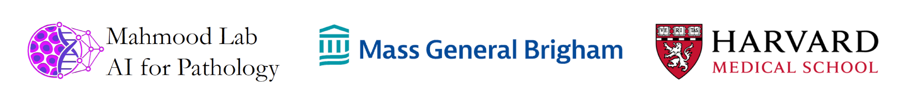

# Spatial Expression-Aligned Learning (SEAL)


[[PDF](https://arxiv.org/pdf/2602.14177) | [Hugging Face 🤗](https://huggingface.co/MahmoodLab/SEAL) | [Installation](https://github.com/mahmoodlab/SEAL?tab=readme-ov-file#quickstart) | [Tutorial](https://github.com/mahmoodlab/SEAL/tree/master/tutorials) | [Cite](https://github.com/mahmoodlab/SEAL?tab=readme-ov-file#citation)]


Inference code for "Towards Spatial Transcriptomics-driven Pathology Foundation Models". This repository contains the basic model code as well as instructions to run inference on H&E and spatial trannscriptomics (ST) samples from the HEST dataset.

## Why SEAL? 

SEAL is a multimodal extension of patch-level pathology foundation models (FMs) that aligns histology with ST. The SEAL training recipe is agnostic to any pathology FMs of interest.

* **🚀 Upgrade existing pathology FMs with molecular signal**: SEAL fine-tunes pretrained patch-level pathology FMs with ST, improving both the slide-level (molecular status, subtyping, pathway expression) and patch-level gene expression prediction performance over original pathology FMs across a large set of benchmarking tasks.
* **🔄 Drop-in replacement**: SEAL vision encoders can be used as feature extractors in existing MIL or linear probing pipelines - no architecture changes required. 
* **🔎 Ask new questions**: SEAL models enable image-to-gene and gene-to-image retrieval, enabling pathway-driven slide exploration and zero-short morphomolecular search


<br clear="right"/>

## Updates

* **02/16/2026**: SEAL pre-release v0.0.1 is online

# Quickstart

## Install uv (if not already installed)

```bash
curl -LsSf https://astral.sh/uv/install.sh | sh
```

## Install dependencies

```bash
uv venv --python 3.11
source .venv/bin/activate
uv sync
```

Default dependency resolution is Linux GPU-first. CUDA/RAPIDS dependencies are included automatically on Linux and skipped on macOS/Windows.

For an explicit cross-platform install, use:

```bash
uv sync --extra cross-platform
```


## Hugging Face CLI Requirement

SEAL uses the Hugging Face CLI backend (`hf` / `huggingface-cli`) for checkpoint downloads in `seal_factory` when `source` is `auto` or `hf`.

Install it (if needed):

```bash
pip install -U "huggingface_hub[cli]"
```

Quick check:

```bash
hf --version
# or
huggingface-cli --version
```

You can then download the model source files using 

```bash
hf download mahmoodlab/seal
```


## Loading Models

```python 
from seal import seal_factory

# load SEAL_conch
(img_model, img_transforms, img_precision), gene_model = seal_factory(backbone="conch")

# Pass token directly (alternative to setting HF_TOKEN)
(img_model, img_transforms, img_precision), gene_model = seal_factory(
    backbone="conch",
    hf_token="hf_..."
)
```

## Supported pathology FMs
The initial version of SEAL supports five different pathology FMs. At this time, Conch and UNIv2 are available via HF.

| Encoder        | Backbone | Embedding Dim | Token Size | Available on HF |
|---------------|----------|:---------------:|:------------:|:------------:|
| `conch` [[1]](https://www.nature.com/articles/s41591-024-02856-4)     | ViT-Base/16 | 512           | 16×16      |✅|
| `h0mini` [[2]](https://arxiv.org/abs/2501.16239)    | ViT-Base/14 | 1,536          | 14×14      ||
| `phikonv2` [[3]](https://arxiv.org/abs/2409.09173) | ViT-Large/16 | 1,024          | 16×16      ||
| `univ2` [[4]](https://www.nature.com/articles/s41591-024-02857-3)  | ViT-Huge/14 | 1,536          | 14×14      |✅|
| `virchow2` [[5]](https://arxiv.org/abs/2408.00738) | ViT-Huge/16 | 2,560          | 16×16      ||


## Setup

By default, `seal_factory` now loads SEAL checkpoints from Hugging Face Hub:
- Repo: `MahmoodLab/SEAL`
- Expected filenames (for backbone `conch`):
  - `seal_conch_vision.pth`
  - `seal_conch_omics.pth`

You can still place local checkpoints in `weights/{backbone}_SEAL/` and `source="auto"` will fall back to local files when a Hub file is unavailable.

### Huggingface Auth


A valid Hugging Face token is required to access the repo.

Provide it as an environment variable:

```bash
export HF_TOKEN="hf_..."
```

or pass it directly to `seal_factory(..., hf_token="hf_...")`.


## Downloading SEAL weights locally to `weights/`

If you prefer local checkpoint files, here is a minimal CONCH example:

```python
from huggingface_hub import hf_hub_download

hf_hub_download(
    repo_id="MahmoodLab/SEAL",
    filename="seal_conch_vision.pth",
    local_dir="weights/conch_SEAL",
)

hf_hub_download(
    repo_id="MahmoodLab/SEAL",
    filename="seal_conch_omics.pth",
    local_dir="weights/conch_SEAL",
)
```

Then load from local files only:

```python
from seal import seal_factory
(img_model, img_transforms, img_precision), gene_model = seal_factory(backbone="conch", source="local")
```

## Acknowledgements
The project was built on top of amazing repositories such as [ViT](https://github.com/google-research/big_vision) and [PEFT](https://github.com/huggingface/peft). We thank the authors and developers for their contribution.


## Citation

If you find this work useful in yours, please consider citing us: 

Hemker, K.\*, Song, A. H.\*, Almagro-Perez, C., Jaume, G., Wagner, S. J., Vaidya, A. J., Simidjievski, N., Jamnik, M. & Mahmood, F. Towards Spatial Transcriptomics-driven Pathology Foundation Models, arXiv pre-print, February 2026.


```
@article{hemker2026seal,
    author = {Konstantin Hemker and Andrew H. Song and Cristina Almagro-Perez and Guillaume Jaume and Sophie J. Wagner and Anurag Vaidya and Nikola Simidjievski and Mateja Jamnik and Faisal Mahmood}, 
    title = {Towards Spatial Transcriptomics-driven Pathology Foundation Models},
    journal = {arXiv preprint arXiv:2602.14177}, 
    year = {2026}
}

```


 
